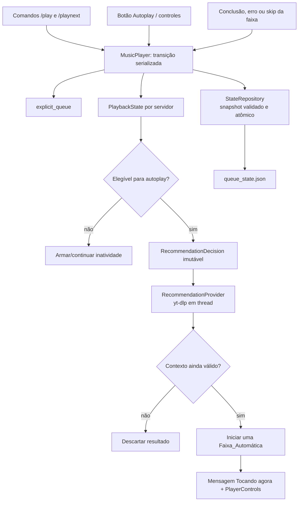

# Design técnico — YouTube Autoplay Queue

## Overview

Esta feature reintroduz o Autoplay isolado por servidor sem transformar recomendações em itens da fila de membros. Quando a faixa atual termina, o player sempre escolhe primeiro a próxima **Faixa_Explícita**; somente com a fila explícita vazia, repetição desligada, Autoplay ligado e uma fonte manual do YouTube válida pode solicitar uma recomendação. Uma recomendação fica fora da fila até ser validada e efetivamente iniciada.

A implementação atual concentra fila, reprodução, controles e persistência em `cogs/music.py`. Ela usa uma única `deque[Track]`, salva JSON diretamente em `queue_state.json` e inicia a tarefa de reprodução no construtor de `MusicPlayer`. O design substitui a semântica dessa fila única por estado explícito de origem e por uma decisão de recomendação versionada, mantendo a integração atual com `discord.py`, `yt-dlp` e FFmpeg.

### Decisões principais

- **Fila explícita como única fila:** `explicit_queue` contém exclusivamente solicitações aceitas por `/play` e `/playnext`. Uma automática nunca é pré-enfileirada.
- **Fonte manual estável:** apenas uma faixa explícita com vídeo YouTube reproduzível, quando começa de fato, redefine `recommendation_source` e zera seu histórico de automáticas. Uma faixa automática nunca muda a fonte.
- **Validação em dois momentos:** a decisão captura um contexto imutável antes de I/O; o resultado do YouTube só pode iniciar reprodução se o mesmo contexto ainda for válido sob o lock do player.
- **Persistência transacional:** a mudança do botão só se torna ativa após o snapshot preparado ter sido publicado atomicamente. Falha de escrita preserva tanto o estado ativo quanto o botão visível.
- **Sem lock durante rede/Discord:** mutações de estado são serializadas por `asyncio.Lock`, mas `yt-dlp`, envio de mensagem e I/O de arquivo ocorrem fora dele para não bloquear `/play`, `/skip` e controles.

### Pesquisa que informa o design

O projeto já incorpora `yt-dlp` pela API Python. A documentação oficial mostra que `YoutubeDL.extract_info(..., download=False)` é a interface suportada para extração e alerta que o retorno pode não ser serializável diretamente; por isso, o design usa um adaptador de recomendações e snapshots próprios, em vez de persistir a resposta bruta do extractor ([yt-dlp: embedding](https://github.com/yt-dlp/yt-dlp#embedding-yt-dlp)). O comportamento do extractor e das superfícies de recomendação do YouTube pode mudar; portanto, o adaptador deve receber uma fonte por `video_id`, consultar uma lista relacionada/radio limitada e retornar somente `Track` normalizados. Falhas são tratadas como ausência de recomendação, não como razão para bloquear o player. O projeto continuará atualizando `yt-dlp` no início, como já faz `bot.py`.

Conteúdo de fontes externas foi parafraseado para conformidade com restrições de licenciamento.

## Architecture



Cada `MusicPlayer` é o proprietário de um estado de servidor. A tarefa `_player_loop` passa a ser uma máquina de estados: espera trabalho, seleciona explicitamente a próxima faixa, toca uma faixa e, após o término, pede à mesma máquina que avalie a elegibilidade. Ela não chama diretamente o YouTube nem depende de uma automática inserida na fila.

`RecommendationCoordinator` é uma colaboração interna do player, não um cog separado: mantém no máximo uma `asyncio.Task` de recomendação pendente por servidor. `RecommendationProvider` encapsula as opções de `yt-dlp`, o URL/consulta de relacionados baseada no `video_id` da fonte e a normalização/filtragem dos candidatos. Esse isolamento permite ajustar o mecanismo de obtenção do YouTube sem misturar detalhes de extractor à política de fila.

`StateRepository` substitui `save_states` por serialização, validação e publicação atômica do estado completo de todos os players. Para manter compatibilidade operacional, o destino continua `queue_state.json` na raiz do projeto, mas ganha versão de esquema e escrita em arquivo temporário no mesmo diretório seguida de substituição atômica.

### Fluxos de seleção

1. Ao aceitar `/play`, anexar as faixas explícitas; ao aceitar `/playnext`, inserir o lote na frente preservando o lote e fazendo a solicitação mais recente vencer a anterior. Ambas as operações invalidam uma decisão pendente porque a fila deixou de estar vazia.
2. Ao terminar ou pular a atual, adquirir o lock e selecionar: repetição aplicável → primeira explícita → avaliação de Autoplay → inatividade. A cabeça de `explicit_queue` sempre ganha de uma automática.
3. Se elegível, criar `RecommendationDecision` com a fonte, versão e condições observadas; liberar o lock; buscar uma candidata em `asyncio.to_thread`.
4. Ao retorno, readquirir o lock e comparar toda a decisão com o estado atual. Se qualquer condição divergir, descartar silenciosamente. Se a candidata qualificada ainda for válida, reservá-la como atual automática e iniciar uma única reprodução.
5. Se o fornecedor falhar ou não houver candidata qualificada enquanto a decisão continua válida, avisar `text_channel` e armar o período existente de 300 segundos. Não fazer nova busca automática nessa transição.

### Invalidação e concorrência

`playback_version` é monotonicamente crescente e é incrementada antes de qualquer transição que possa tornar um resultado atrasado incorreto: aceitar faixa explícita, iniciar uma explícita YouTube, alterar Autoplay após persistir, pular, parar, limpar quando houver decisão pendente, alterar repetição e sair/desconectar. A decisão também contém fonte, valor de Autoplay, repetição, fila vazia e conexão esperados; essas verificações redundantes tornam o descarte correto mesmo se uma futura alteração esquecer de incrementar a versão.

Uma decisão é válida somente se: o player ainda está conectado; `autoplay_enabled` é verdadeiro; `loop_mode == "off"`; `explicit_queue` está vazia; `recommendation_source` é idêntica; e `playback_version` é idêntica. Antes de chamar `voice_client.play`, a implementação revalida sob lock e marca `recommendation_task` como consumida. Assim, duas respostas ou callbacks não podem iniciar duas faixas automáticas.

Pausa e retomada não incrementam a versão nem avaliam recomendação: a faixa continua sendo a atual. Desligar Autoplay durante automática preserva a reprodução em curso, mas invalida a decisão pendente e impede a próxima. `stop` interrompe a atual, limpa a fila, invalida a decisão e só deixa o fluxo de inatividade. `leave` também descarta fonte, histórico e tarefa pendente antes de desconectar.

## Components and Interfaces

### `MusicPlayer` (refatorado)

Responsabilidades:

- possuir `PlaybackState`, `explicit_queue`, lock e tarefas por guild;
- aplicar transições de comandos, botões, callbacks de áudio e restauração;
- escolher a próxima ação por `select_next_action()`;
- iniciar playback, publicar a mensagem e coordenar inatividade;
- delegar persistência e recomendação, sem executar I/O sob lock.

Interface conceitual:

| Operação | Entrada | Efeito |
|---|---|---|
| `enqueue_explicit(tracks, priority)` | faixas normalizadas e prioridade | atualiza somente `explicit_queue`, invalida decisão e persiste |
| `set_autoplay(prepared_value)` | novo booleano | persiste snapshot preparado; somente em sucesso aplica, atualiza view e talvez avalia autoplay |
| `on_track_finished(reason)` | término, erro ou skip | remove/reseta atual e seleciona repetição, explícita, recomendação ou inatividade |
| `maybe_request_recommendation()` | estado atual | cria no máximo uma decisão se todos os pré-requisitos forem verdadeiros |
| `accept_recommendation(decision, candidate)` | contexto e candidata | revalida e inicia uma automática sem tocar a fila explícita |
| `destroy()` | saída/idle | invalida decisão, limpa estado transitório, remove snapshot e desconecta |

### `TrackResolver`

Centraliza a normalização atual de resultados do `yt-dlp` para solicitações manuais e para recomendações. Deve identificar se a faixa resolve para um vídeo YouTube reproduzível e guardar seu `video_id`; links SoundCloud/Spotify convertidos podem continuar tocando como explícitos, mas não substituem a fonte de recomendação.

A resolução de stream já existente em `_play_track` continua ocorrendo no momento de tocar. A faixa só é tratada como “começou a tocar” após `voice_client.play(...)` aceitar a fonte. Se a resolução da faixa explícita falhar, ela é anunciada como ignorada e não altera fonte nem histórico. Se uma candidata automática falhar na qualificação/stream antes de começar, é reportada como falha da obtenção; a transição termina em inatividade em vez de enfileirar outra automática especulativa.

### `RecommendationProvider`

```text
async fetch_qualified(source: YouTubeSource, excluded_ids: frozenset[str], current_id: str | None)
    -> RecommendationResult[Track] | NoQualifiedRecommendation | RecommendationFailure
```

Implementação prevista:

- executar extração em thread com timeout, limite pequeno de candidatos e `noplaylist`/modo plano quando apropriado;
- construir a consulta relacionada/radio a partir exclusivamente do `video_id` normalizado da fonte, nunca de título fornecido pelo usuário;
- para cada candidato, exigir `platform == "youtube"`, `video_id`, URL de página e metadados suficientes; descartar o vídeo atual, a própria fonte quando igual à atual e IDs em `automatic_history`;
- qualificar/revalidar a capacidade de reprodução antes de devolver a primeira candidata válida;
- não persistir cookies, URL de stream temporária, resposta crua do YouTube ou uma lista de candidatos.

O provedor retorna tipos de resultado explícitos para distinguir “não havia candidata qualificada” de uma exceção de rede/extractor. Ambos levam à mensagem de falha definida nos requisitos, com detalhe técnico somente em log.

### `PlayerControls` e apresentação

`PlayerControls` recebe o player e cria quatro botões persistentes por mensagem: pausar/retomar, pular, parar e exatamente um botão `Autoplay: ligado` ou `Autoplay: desligado`. O `custom_id` do botão de Autoplay deve incluir a ação estável, não o estado de uma mensagem específica; a instância da view usa o player da guild para ler o estado atual sob lock.

Ao clicar:

1. responder/deferir a interação efêmera;
2. calcular o valor oposto sob lock, sem ainda expor o estado como ativo;
3. pedir ao repositório que publique um snapshot contendo o valor preparado;
4. em sucesso, aplicar o valor, incrementar versão, atualizar somente a view/label da mensagem atual e confirmar o novo texto efêmero; se ficou elegível, chamar a avaliação depois da persistência;
5. em falha, não mudar memória nem view e enviar resposta efêmera de falha.

`_announce_now_playing` e `/nowplaying` usam `TrackOrigin` para mostrar `Origem: Recomendação automática` ou `Origem: solicitação de <membro>`, além de `Autoplay: ligado/desligado`. `/queue` mostra esse estado, qualifica a atual da mesma forma e lista apenas `explicit_queue`; não há qualquer candidata automática a exibir como “próxima”.

### `StateRepository`

Interface conceitual:

```text
serialize(players) -> PersistedDocument
validate(document) -> ValidatedPersistedDocument | ValidationError
publish(document) -> None | PersistenceError
load() -> ValidatedPersistedDocument | MissingOrInvalidState
```

`publish` escreve JSON completo e validável em arquivo temporário no mesmo diretório, faz flush e `fsync`, troca com `os.replace` e registra exceções. Um erro antes de `replace` preserva o último arquivo completo. Apenas depois de retorno bem-sucedido a mudança que depende de persistência — em especial Autoplay — pode ser aplicada à memória.

Na inicialização, `_restore_states` lê e valida todo snapshot de uma guild antes de conectar ou mutar um player. Com ao menos um humano no canal, cria `RestoredPlaybackState` isolado, aplica seus campos sob lock em uma única transição e somente depois desperta o loop para escolher a próxima faixa. Snapshot ausente, inválido, incompleto ou sem fonte válida não restaura automáticas: aproveita somente faixas explícitas válidas e deixa o player ocioso quando não houver nenhuma. Snapshot de canal sem humanos é descartado e removido da próxima publicação.

## Data Models

```python
# Tipos conceituais; não são implementação.
class TrackOrigin(Enum):
    EXPLICIT = "explicit"
    AUTOMATIC = "automatic"

@dataclass(frozen=True)
class YouTubeSource:
    video_id: str
    webpage_url: str

@dataclass
class Track:
    url: str
    title: str
    duration: int | None
    requested_by_id: int | None
    requested_by_name: str | None
    origin: TrackOrigin
    provider: str                         # "youtube", "soundcloud", etc.
    video_id: str | None
    is_live: bool = False

@dataclass(frozen=True)
class RecommendationDecision:
    source: YouTubeSource
    autoplay_enabled: bool
    explicit_queue_empty: bool
    loop_mode: str
    playback_version: int

@dataclass
class PlaybackState:
    autoplay_enabled: bool = True
    recommendation_source: YouTubeSource | None = None
    automatic_history: set[str] = field(default_factory=set)
    current: Track | None = None
    loop_mode: Literal["off", "musica", "fila"] = "off"
    volume: float = 0.5
    playback_version: int = 0
```

`explicit_queue: deque[Track]` tem a invariante `origin == EXPLICIT` para cada item. `current` pode ter qualquer origem. `automatic_history` contém IDs de automáticas que **começaram** sob a fonte vigente, jamais itens especulativos. Ao iniciar uma explícita YouTube, o player define nova `YouTubeSource`, limpa o set e incrementa a versão antes de se tornar elegível à próxima decisão. Ao iniciar uma automática, preserva a fonte e acrescenta o ID iniciado ao set.

O documento persistido é versionado e inclui, no mesmo snapshot por guild: canal de voz/texto, `autoplay_enabled`, fonte, histórico, atual com origem, fila explícita, repetição e volume. `playback_version`, view, stream URL, task pendente e timers são transitórios e não são persistidos. A validação rejeita enum desconhecido, IDs vazios/duplicados onde proibidos, `origin=AUTO` sem fonte válida e automáticas dentro da fila explícita.

## Correctness Properties

*A property is a characteristic or behavior that should hold true across all valid executions of a system-essentially, a formal statement about what the system should do. Properties serve as the bridge between human-readable specifications and machine-verifiable correctness guarantees.*

### Reflexão sobre propriedades

As propriedades de append/prepend de fila foram consolidadas numa única propriedade de ordenação explícita, pois ela cobre as regras de `/play`, `/playnext` e ambas as origens da faixa atual. A criação e o descarte de decisões foram separados da filtragem de candidatas: a primeira valida concorrência e elegibilidade; a segunda valida unicidade e histórico. A redefinição de fonte explícita cobre igualmente o caso em que ela sucede uma automática. Isso evita propriedades que apenas repetiriam a mesma invariante com uma origem concreta diferente.

### Property 1: Ordenação e prioridade absoluta da fila explícita

**For any** sequência válida de operações `/play` e `/playnext`, com repetição desligada, `explicit_queue` SHALL conter as últimas solicitações `/playnext` em ordem cronológica inversa seguidas das solicitações `/play` em ordem cronológica, e a seleção da próxima faixa SHALL escolher sua cabeça antes de qualquer Faixa_Automática, independentemente da origem da faixa atual.

**Validates: Requirements 2.1, 2.2, 2.3, 2.4, 2.5, 2.6, 2.7, 6.3**

### Property 2: Elegibilidade e invalidação de recomendações

**For any** estado de player e evento de término ou skip, uma `RecommendationDecision` SHALL ser criada somente se Autoplay estiver ligado, a fila explícita estiver vazia, repetição estiver desligada, houver fonte válida e o player estiver conectado; **for any** resultado associado a uma decisão cuja versão, fonte, Autoplay, fila, repetição ou conexão tenha mudado, o resultado SHALL ser descartado sem iniciar uma Faixa_Automática.

**Validates: Requirements 1.6, 3.1, 3.2, 3.4, 3.5, 6.4, 6.7**

### Property 3: Aceitação de recomendação qualificada

**For any** resposta de recomendação qualificada recebida para uma decisão ainda válida, o player SHALL iniciar exatamente uma Faixa_Automática que não seja a faixa atual e cujo `video_id` não pertença ao histórico da fonte vigente, e SHALL adicionar exatamente o ID iniciado ao histórico sem inseri-lo em `explicit_queue`.

**Validates: Requirements 3.3, 3.5, 4.2, 5.4**

### Property 4: Contexto manual de recomendação

**For any** Faixa_Explícita que comece com um vídeo YouTube reproduzível, o player SHALL substituir a fonte pelo vídeo iniciado, limpar o histórico e incrementar a versão; **for any** Faixa_Explícita sem vídeo YouTube reproduzível, SHALL preservar fonte e histórico; e **for any** início de automática, SHALL preservar a fonte e o histórico anterior exceto pelo ID automático iniciado.

**Validates: Requirements 4.1, 4.2, 4.3, 4.4**

### Property 5: Invariantes dos controles de interrupção

**For any** estado válido, `stop` SHALL deixar sem atual e sem fila explícita, `clear` SHALL remover somente a fila explícita e preservar Autoplay/fonte/histórico/atual, e `leave` SHALL remover fila, fonte, histórico e decisão pendente; as operações que invalidam recomendação SHALL incrementar `playback_version`.

**Validates: Requirements 6.5, 6.6, 6.8**

### Property 6: Round-trip do estado recuperável

**For any** estado recuperável válido, serializar, validar e desserializar SHALL preservar Autoplay, fonte, histórico, origem da atual, fila explícita, repetição e volume; **for any** estado restaurado válido, a aplicação SHALL ocorrer como uma transição antes da seleção da próxima faixa e nunca introduzir uma automática na fila explícita.

**Validates: Requirements 7.1, 7.4**

## Error Handling

| Situação | Comportamento observável | Estado seguro |
|---|---|---|
| Falha ao persistir toggle Autoplay | resposta efêmera de falha; botão conserva rótulo anterior | Autoplay ativo e snapshot anterior inalterados |
| Falha/timeout/nenhuma candidata do YouTube | mensagem breve no canal do player; causa detalhada no log | nenhuma automática inicia; inatividade é armada |
| Resposta atrasada do YouTube | nenhum anúncio e nenhum playback | resultado é descartado após revalidação |
| Faixa manual sem YouTube reproduzível | aviso de faixa ignorada | fonte e histórico anteriores preservados |
| Erro ao resolver stream manual | anúncio atual de erro e avanço normal da fila | não redefine fonte, não gera automática prematura |
| Erro ao resolver candidata automática | aviso e inatividade, sem re-enfileirar a candidata | fila explícita permanece intacta |
| Snapshot inválido/incompleto | log de validação e descarte de automáticas | apenas explícitas válidas podem ser restauradas |
| Erro durante publicação do snapshot | log de diagnóstico; arquivo anterior continua disponível | estado ativo não é alterado para operações transacionais |
| Sem humanos ao restaurar | não conectar nem retomar; remover do próximo snapshot | não toca estado abandonado |
| Exceção Discord ao editar/enviar view | registrar aviso e continuar playback | estado do player permanece correto; próxima mensagem recompõe os controles |

Erros técnicos não devem expor URL de stream, cookies, token, stack trace ou detalhes de extractor ao canal Discord. Logs devem incluir guild, versão, origem e tipo de falha; títulos e URLs exibidos seguem a sanitização atual do bot.

## Testing Strategy

A feature combina máquina de estados e integrações Discord/arquivo/YouTube. Assim, testes de unidade e de integração tratam efeitos concretos, enquanto property-based tests cobrem invariantes das transições puras. O pacote recomendado é **Hypothesis** com `pytest`/`pytest-asyncio`; cada propriedade abaixo deve executar no mínimo 100 exemplos e conter comentário no formato `Feature: youtube-autoplay-queue, Property N: <texto da propriedade>`.

### Testes de unidade e exemplos

- Player recém-criado sem snapshot usa `autoplay_enabled=True` e o próximo snapshot o contém (1.1).
- A view de “Tocando agora” tem exatamente um botão Autoplay e os dois rótulos possíveis; embeds e `/queue` exibem origem/autoplay corretos para atual explícita e automática (1.2, 5.1–5.4).
- Toggle usa repositório fake para provar ordem prepare → persist → aplicar → editar → resposta; falha não muda memória nem label; sucesso elegível somente inicia avaliação depois do commit (1.3–1.5, 1.7).
- Pausar automática não chama provedor; retomar reproduz a mesma atual e mantém fonte/histórico (6.1–6.2).
- Provedor mockado sem resultado e com exceção envia aviso, não inicia automática e aciona inatividade (3.6).
- Recuperação ausente, malformada, com fonte ausente e canal sem humanos restaura somente explícitas permitidas ou nada (7.5–7.6).

### Testes de propriedades

Geradores constroem IDs YouTube únicos, tracks explícitas/automáticas, sequências de comandos, modos de repetição e snapshots válidos. As seis propriedades desta seção são implementadas por seis testes Hypothesis — um por propriedade — com ao menos 100 exemplos cada. Casos vazios, múltiplos `/playnext`, alteração de Autoplay durante fetch, mudança de fonte, skip, stop, clear e saída devem fazer parte das estratégias.

### Testes de integração controlada

- `StateRepository` usa diretório temporário para verificar que uma publicação completa substitui o documento e uma falha injetada antes da substituição conserva o snapshot anterior e o estado em memória (7.2–7.3).
- Um `RecommendationProvider` com fixture/resposta gravada verifica que fonte YouTube gera candidatos normalizados e que itens atual/histórico/inválidos são filtrados. Não chamar YouTube real em suíte regular.
- Fakes de `discord.Interaction`, `VoiceClient` e `Message` verificam callbacks, efeitos efêmeros, edição do botão, não duplicação de `play` e reconexão/restauração.
- Um smoke test manual, opcional e isolado, confirma em um servidor de teste que uma fonte pública do YouTube produz uma recomendação; ele não é requisito para o CI e não usa credenciais registradas.

A validação de implementação futura deve executar a suíte uma vez (sem modo watch), além de lint/type check configurados no projeto. Testes externos não devem depender de recomendações específicas do YouTube, pois sua ordem e disponibilidade são voláteis.
